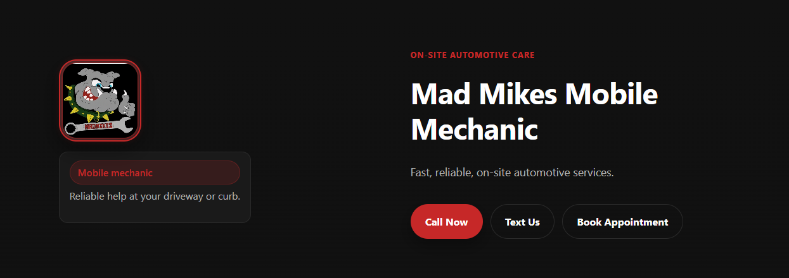
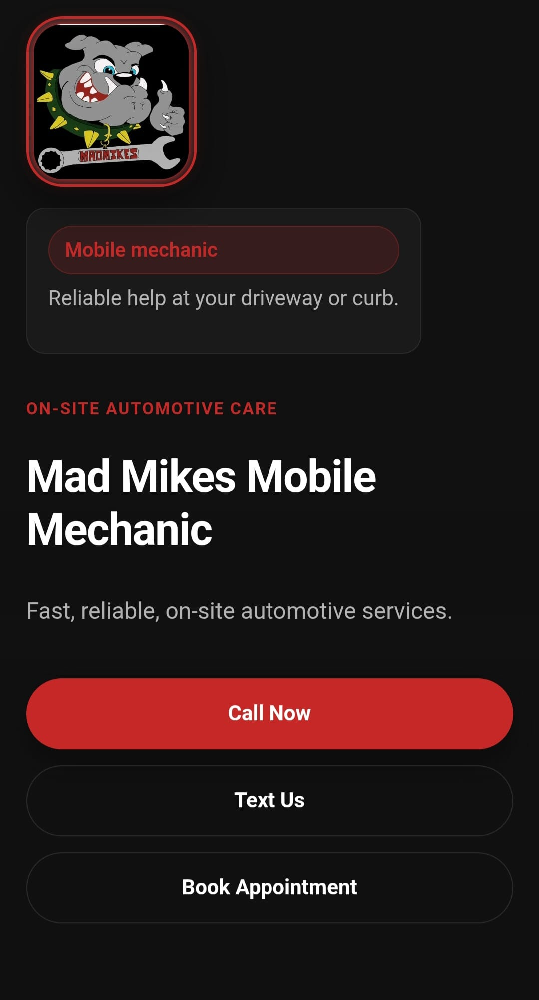
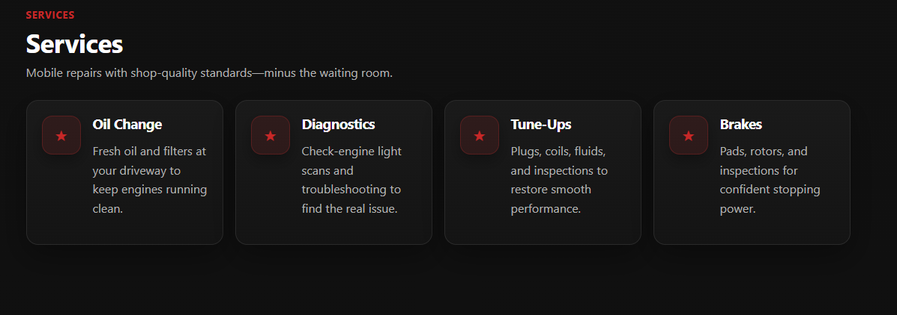
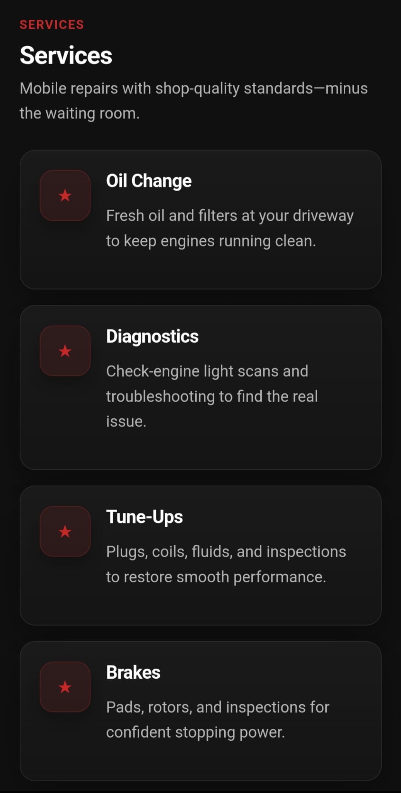
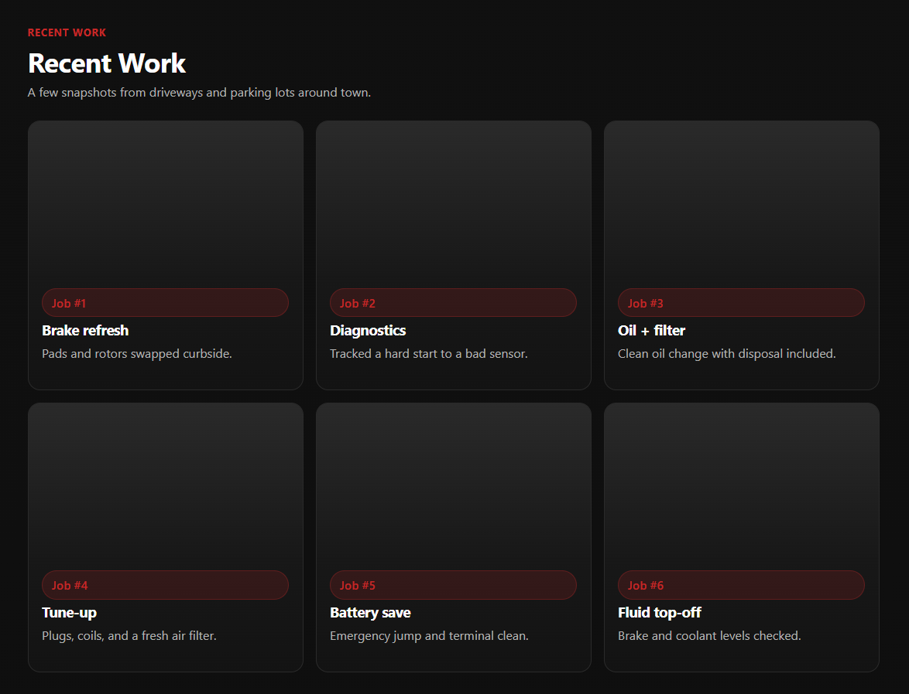
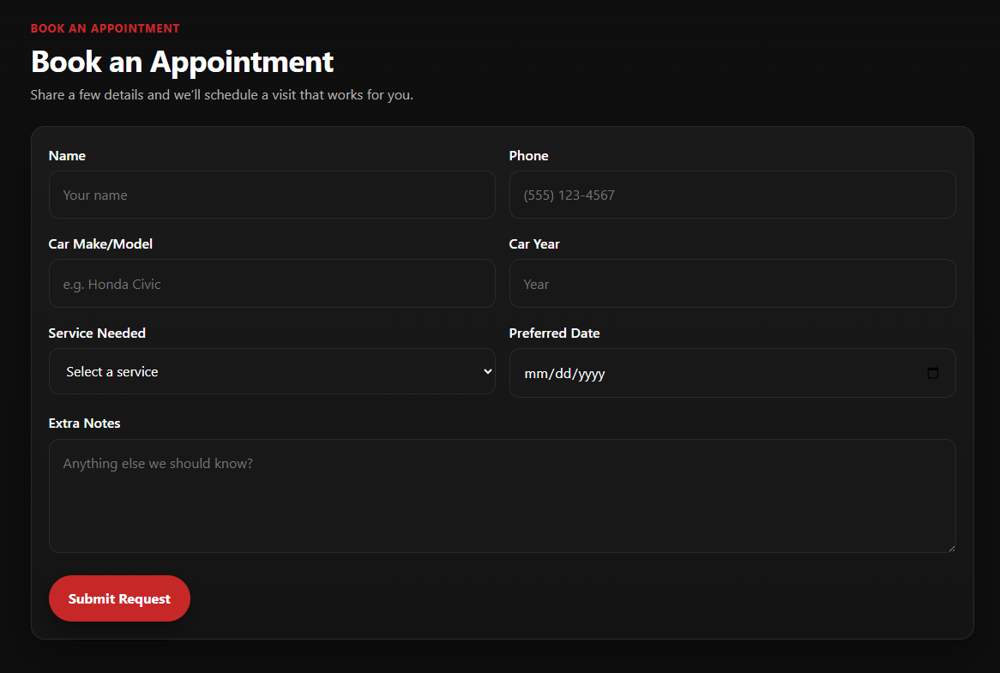
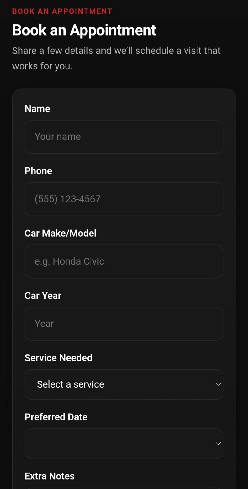
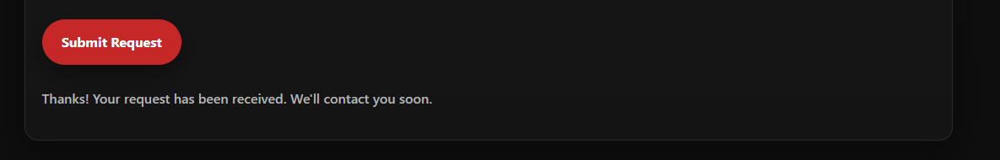
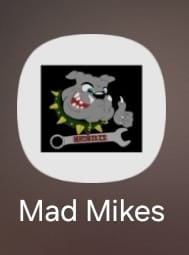

# Mad Mikes Mobile Mechanic — Landing Page & Booking App

**Live Site:** https://mad-mike-mobile-mechanic.vercel.app/  
**Tech:** Vite + React, CSS, Formspree, Vercel, PWA Manifest

---

## 🚗 Project Overview

Mad Mikes Mobile Mechanic is a one-page landing/booking website for a mobile mechanic located in Saint Cloud, FL.  
The goal was to create a fast, modern, mobile-first experience where users can:

- View available services
- See examples of recent work
- Submit an appointment request
- Call or text directly from their phone
- Install the website as a mobile app (PWA)

This project includes strong UX design, interactive form validation, backendless email functionality, and SEO optimization.

---

## 🎨 Brand-Driven UI

The design uses a rugged automotive-style theme inspired by the client's bulldog logo:

- ⚫ Industrial black & charcoal backgrounds
- 🔴 Mechanic red accent color
- ⚪ High-contrast white & muted text
- 🛠️ Clean card-based layout for services and gallery

---

## 🧩 Features

### ✔ Responsive Hero Section

- Bulldog logo
- Business name + tagline
- One-tap **Call Now** and **Text Us** buttons
- “Book Appointment” CTA

### ✔ Services Section

- Grid layout
- Simple and readable
- Icons + descriptions
- Mobile-first structure

### ✔ Recent Work (Gallery)

- Ready for real client job photos

### ✔ Appointment Form (with validation)

- Required fields: name, phone, service
- Phone formatting handled (digits-only validation)
- Error + success messages
- Form clears on successful submission
- Sends email notifications through **Formspree**
- Failures show errors without clearing form

---

## 🛡 SEO & Metadata

- Custom `<title>` and `<meta description>`
- Meta keywords for Saint Cloud FL auto repair
- Full **Open Graph** setup for social sharing
- **Twitter card** preview
- Works on Facebook, Instagram, Messenger, WhatsApp, LinkedIn, SMS apps

---

## 📱 PWA (Progressive Web App) Support

- `manifest.json` included
- Icons: 180×180, 192×192, 512×512
- Recognized by Chrome as an installable app
- Bulldog icon appears on the home screen

---

## 🛠 Tech Stack

- **React (Vite)**
- **CSS**
- **Formspree** (email form handling)
- **Vercel** (deployment + hosting)
- **PWA Manifest & Icons**
- **Open Graph / SEO**

---

## 📸 Project Showcase

### 🖥️ Desktop Hero

  

### 📱 Mobile Hero

  

---

### 🧰 Services Section (Desktop)

  

### 🧰 Services Section (Mobile)

  

---

### 🖼️ Recent Work / Gallery (Desktop)

  

---

### 📝 Appointment Form (Desktop)

  

### 📝 Appointment Form (Mobile)

  

---

### ✅ Successful Form Submission

  

---

### 📲 PWA Install Screen

  

---

## 🌐 Live Demo

https://mad-mike-mobile-mechanic.vercel.app/

---

## 🧑‍💻 Author

Jose Canela
Ride & Show Technician · Software Engineer
GitHub: [@Jcanela-g](https://github.com/Jcanela-g)
